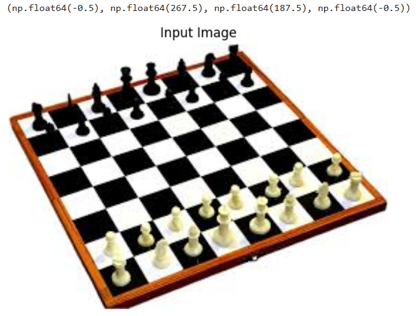
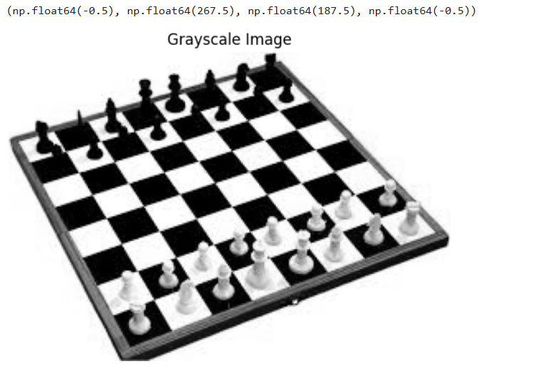
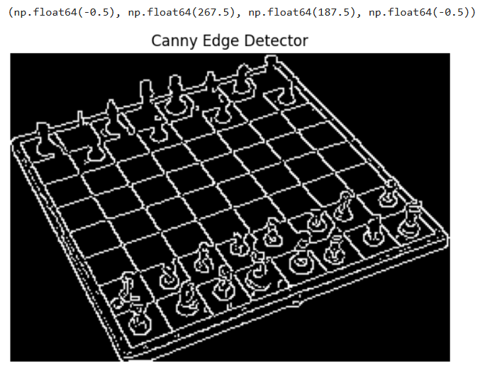
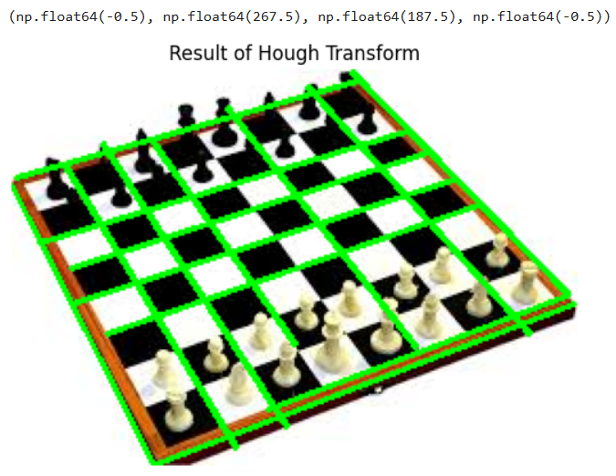

# Exp-7-Record-HOUGH-TRANSFORM
# Edge-Linking-using-Hough-Transform
## NAME: Krithika Lakshmi M
## REG: 212224230134
## Aim:
To write a Python program to detect the lines using Hough Transform.

## Software Required:
Anaconda - Python 3.7

## Algorithm:
### Step1:
Import all the necessary modules for the program.

### Step2:
Load a image using imread() from cv2 module.

### Step3:
Convert the image to grayscale.

### Step4:
Using Canny operator from cv2,detect the edges of the image.

### Step5:
Using the HoughLinesP(),detect line co-ordinates for every points in the images.Using For loop,draw the lines on the found co-ordinates.Display the image.

## Program:
### Input Image 

```
import cv2
import numpy as np
import matplotlib.pyplot as plt

image = cv2.imread('Qn_7_.jpg')  # Replace 'image.jpg' with your image path

gray_image = cv2.cvtColor(image, cv2.COLOR_BGR2GRAY)

plt.imshow(cv2.cvtColor(image, cv2.COLOR_BGR2RGB))  # Convert image to RGB for displaying
plt.title("Input Image")
plt.axis('off')

```
### Output



### Grayscale Image

```
plt.imshow(gray_image, cmap='gray')
plt.title("Grayscale Image")
plt.axis('off')
```
### Output



### Canny Edge detector output

```
edges = cv2.Canny(gray_image, 50, 150)  # Canny edge detection with threshold values 50 and 150

plt.imshow(edges, cmap='gray')
plt.title("Canny Edge Detector")
plt.axis('off')

```

### Output



### Display the result of Hough transform

```
lines = cv2.HoughLinesP(edges, 1, np.pi / 180, 100, minLineLength=50, maxLineGap=10)

for line in lines:
    x1, y1, x2, y2 = line[0]  
    cv2.line(image, (x1, y1), (x2, y2), (0, 255, 0), 2)

plt.imshow(cv2.cvtColor(image, cv2.COLOR_BGR2RGB))  # Image with lines drawn
plt.title("Result of Hough Transform")
plt.axis('off')

```
### Output



## Result:
Thus, the image has been successfully converted.